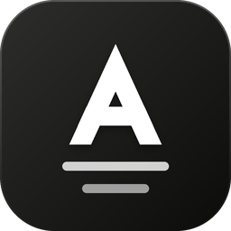
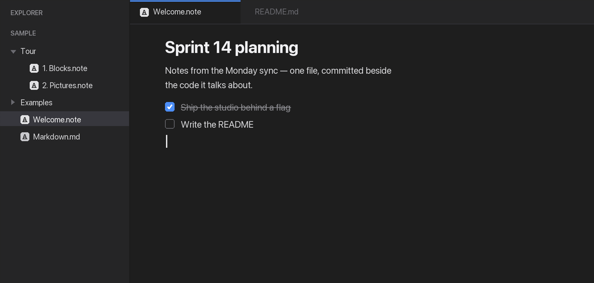

<p align="center">
  
</p>

<h1 align="center">ANote</h1>

<p align="center">
  <strong>Write markdown the way you write in Notion, inside VS Code.</strong>
</p>

<p align="center">
  
</p>

ANote opens a `.md` as a block editor — headings, tables, checklists, code blocks
and images typed as they look, no preview pane to read them in. Save, and it is
plain markdown on disk again.

Right-click any `.md` → **Open as Note**. VS Code's own markdown editor stays
where it is; ANote never takes over every `.md` in a repo you cloned.

## The `.note` format

For notes markdown can't hold: Excalidraw drawings edited in place, playable
video and audio, resizable images, coloured text and table cells, toggle lists,
tabs. Anything you drop is written to `<note>.note.assets/` beside the note and
referenced relatively, so a note and its files move, commit and get deleted as
one thing.

Design docs are `.note`. The README stays `.md`. Both open in the same editor.

## Reading it elsewhere

- **Preview to the side** — rendered in a webview, following your theme
- **Preview in the browser** — a copyable link; works over SSH, WSL, containers
  and Codespaces
- **Studio** — a notes folder as a full page, notes left and block editor right,
  in a browser tab
- **MCP server** — VS Code's agent can list, search, read, create, write, append
  and edit notes, section by section

The tree, rename, move, delete, tabs and saving are left to VS Code.

## Getting started

Open a folder, right-click any `.md` → **Open as Note**. For a note of your own:
right-click a folder → **New Note**.

`/` opens the block menu. `⌘S` / `Ctrl+S` saves, like any other file.

## Commands

All under the **ANote** category.

| Command                                     | What it does                                           |
| ------------------------------------------- | ------------------------------------------------------ |
| Open as Note                                | Opens a `.md` in the block editor                      |
| New Note                                    | Creates a `.note` in the chosen folder                 |
| Open Preview to the Side                    | The rendered note, in a webview                        |
| Switch Preview Theme                        | Editor → light → dark                                  |
| Open Preview in Browser / Copy Preview Link | The note as a page on a loopback port                  |
| Open Studio in Browser / Copy Studio Link   | The folder's notes, editable in a browser tab          |
| Export as Markdown                          | Writes a `.note` out as `.md`                          |
| Open Configuration                          | Writes `anote.config.json` with the defaults filled in |

## Good to know about `.md`

Underline, toggle lists, tabs, colours and image resizing are removed from the
menus over a `.md` rather than offered and then lost on save. Drawings, video and
audio survive — they ride in an HTML comment other markdown readers ignore.

Before typing in someone else's markdown: ANote reads a practical subset, and the
first keystroke rewrites the file in its own dialect — hard-wrapped paragraphs
come back as one line, reference links are flattened. If a file's round trip is
not the same file, ANote says so once, before anything is written. Nothing
touches disk until you save.

## Configuration

One optional `anote.config.json` per workspace folder. Every key is optional, and
a bad value falls back to the default with a warning.

```jsonc
{
  "notesDir": ".", // where New Note writes, and what the MCP server reads
  "newNote": { "defaultName": "Untitled" },
  "assets": {
    "dir": "anote.assets", // the one folder every note's files go in, under notesDir
    "dirSuffix": ".assets", // legacy: the <note>.note.assets folders, still read
  },
  "preview": {
    "theme": "auto", // auto | light | dark
    "pollMs": 2000, // how often a browser tab asks if the note changed
    "port": 0, // 0 lets the OS pick; a number is a bookmarkable URL
  },
  "studio": { "enabled": true },
  "mcp": { "enabled": true },
}
```

The browser preview and the studio share one HTTP server bound to loopback only,
with origin-checked reads and token-guarded, version-checked writes. Set
`studio.enabled` to `false` and the writable half is never mounted. Details in
[docs/design.md](docs/design.md).

## Development

Requires VS Code 1.101 or later; everything else is bundled.

```bash
bun install
bun run build   # then F5, which opens sample/ as the workspace
bun run test
```

`sample/` is a guided demo: start at `Welcome.note`, then the `Tour/` notes. For
the design rationale — file format, previews, studio, host↔webview bridge — see
[docs/design.md](docs/design.md).

## License

MIT
